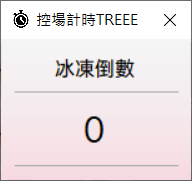
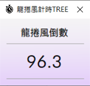
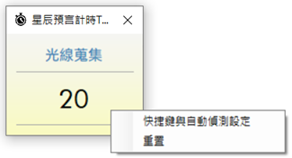

## 這是一項 2021 年的開源計時器專案，目前已不再更新，若有需要請自行下載使用
### 毛毛計時TREE 介紹

這個程式可以用來輔助玩家在艾爾之光中的各種計時需求。

**下載：**[**TREEEEE**](https://github.com/wonk2563/Raid_ControlCounter/releases/download/Release/MaoTimeCounter.zip)

**※** 2021.12.11 新增多個功能與計時器，更新計時器UI。

### 使用說明：

**１**. 下載下來後解壓縮，會有多個檔案。

**２**. 開啟毛毛計時TREE.exe

**３**.點擊所需計時器即可，各詳細功能看下方介紹

**４**. 點擊隱藏首頁按鈕，程式將會縮小至狀態列；點擊小圖示將會再次顯示首頁

**５**. 點擊重設位置按鈕，程式會將目前開啟的計時器視窗，全部移至畫面中心  
  
※ 現在關閉計時器後，程式會記錄最後關閉的位置

**６**. 點擊檢查更新按鈕，程式將會檢查目前是否有更新可用

**７**. 點擊回報按鈕，可直接回報相關問題或建議

  

### １２襲擊控場計時ＴＲＥＥ

這個計時器可以直接用來計算降抗值、冰凍秒數，在遊戲中按下快捷鍵後就會直接開始倒數。

**※** 2021.012.11 更新計時器UI。

**※** 2021.04.16 DAB 冰凍秒數修正為 6.5 秒。

**※** 2021.04.08 降抗、控場角色新增 NP，冰凍時間調整為四捨五入至小數點第一位，現在會記錄控場角色選單的選項。

**※** 2020.09.05 修正秒數計算錯誤的問題，調整控場選單的版面，BL技能介紹新增\[轉換\]\[藍\]安魂。

使用說明：

**１**. 在視窗內右鍵可以設定降抗與控場等

**２**. 依照隊伍中的狀況勾選降抗角與稱號、道具，勾選完按確定

**３**. 如上一步驟勾選控場角色 ( 冰凍秒數以紅字技能做計算 )、選擇技能或道具快捷鍵

**４**. 都勾選完後，便會計算出冰凍時間，在遊戲中使用技能或道具時便會自動倒數

**※** 每按一次快捷鍵會重新計時

**※** 當角色選擇NP時，計時倒數會延遲 1.8 秒

**※** 冰凍秒數採四捨五入至小數第一位

  

### １５５龍捲風計時ＴＲＥＥ

這個計時器可以用來協助玩家判斷１５５－Ｒ２是否要出龍捲。

使用說明：

**１**. 在視窗內右鍵可以設定快捷鍵與重置計時

**２.** **從快捷鍵設定頁面可以設定倒數快捷鍵，按下後會開始倒數

**３.** **進入１５５－Ｒ２後便可開始倒數，當１００秒結束時差不多就會開龍捲

  

### 守護者稱號計時ＴＲＥＥ

這個計時器可以用來協助玩家判斷１１５稱號的冷卻時間是否快結束。

使用說明：

**１**. 在視窗內右鍵可以設定快捷鍵

**２**. 從快捷鍵設定頁面可以設定倒數快捷鍵

**※** 首要與副啟動快捷鍵可分別設定兩個啟動快捷，如CTRL與洋蔥放置的位置

**※** 重置快捷鍵則依需求設定即可，按下會重置計時，以防誤按

  

### 領悟時分計時ＴＲＥＥ

這個計時器可以用來協助玩家判斷領悟時分的冷卻時間是否快結束。

使用說明：

**１**. 在視窗內右鍵可以設定快捷鍵

**２**. 從快捷鍵設定頁面可以設定多個技能快捷鍵，按下後會開始倒數

  

### 星辰預言計時ＴＲＥＥ

這個計時器可以用來協助玩家判斷星辰預言目前會施放出的顏色。

使用說明：

**１**. 在視窗內右鍵可以設定快捷鍵和重置計時

**２**. 從快捷鍵設定頁面可以設定

**啟動快捷鍵**：啟動計時器倒數，於副本進場時使用

**暫停快捷鍵**：暫停計時器倒數，於副本過場時使用

**偵測靈敏度**：設定自動偵測靈敏度，愈高愈容易自動啟動倒數

**啟用自動偵測**：啟用後會自動偵測是否進入副本，進入後開始倒數  
  
**※** 自動偵測是擷取遊戲畫面做判斷，所以要使用時請勿大面積遮擋遊戲畫面

  

### 自訂計時ＴＲＥＥ

這個計時器可以用來自行設定秒數做計時。

使用說明：

**１**. 在視窗內右鍵可以設定快捷鍵與秒數和重置計時

**２**. 從快捷鍵設定與秒數頁面可以設定

**快捷鍵**：啟動計時器倒數，再次按下會重新計時

**秒數**：自行設定秒數

